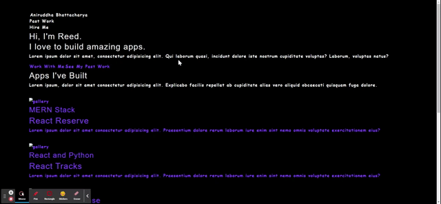

# Documentation
Note I am not really proud of this work, I am just submitting it at this point to get a grade. Right now my team project is suffering from a crisis I fear will not be solved by the due date.

I am currently finished with component building and writing the details within the components. There were a few things that I am not able to correctly do. But I think its because I jumbled up some code on my end. I was trying to alter a tutorial I found online, however for styling I tried to use Tailwind CSS. But after I saw that it may take too long to figure out how to properly implement it I decided to abandon it, Now if I had time I would use react bootstrap, but unfortunately time is not on my side. Maybe I may reflect on this assignment and redo it. But right now I should just submit it as is and highlight the errors.

Here is a local host screenshot.

